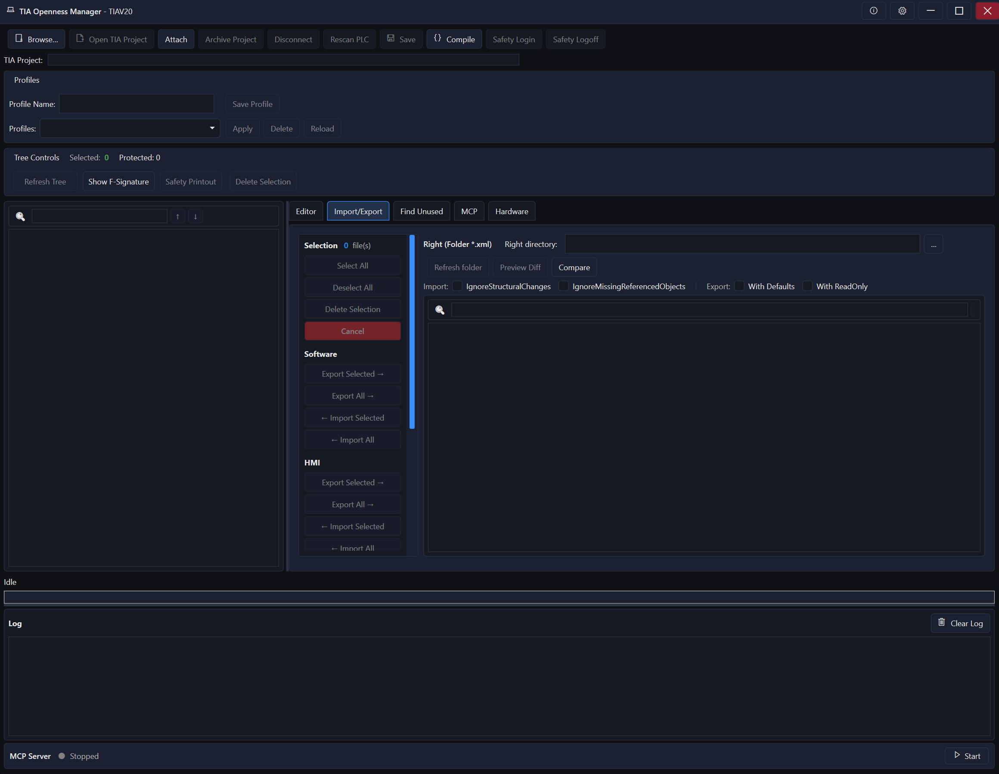
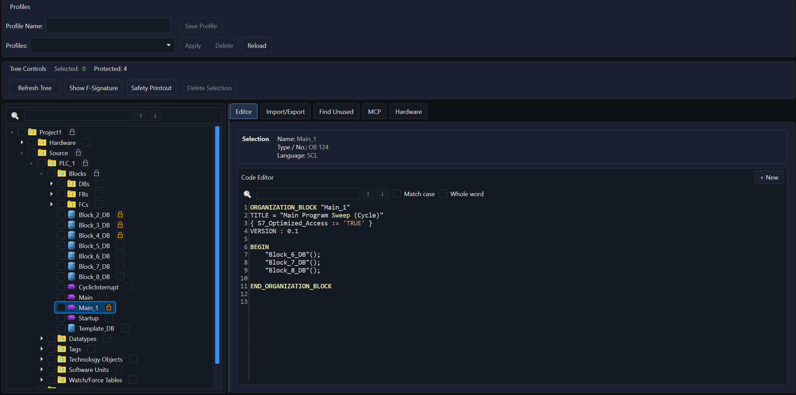
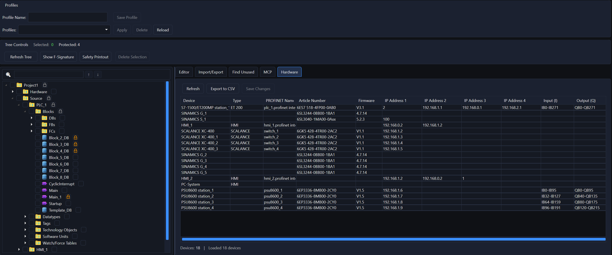

# TIA Openness Manager

**Streamline Your Siemens TIA Portal Workflow**

---

## What is TIA Openness Manager?

TIA Openness Manager is a powerful tool for Siemens TIA Portal developers that revolutionizes the export, import, and management of PLC program blocks. With an intuitive user interface and advanced features like difference comparison, protection profiles, and AI integration, it significantly increases productivity and reduces errors in project management.

**Key Benefits:**
- Export/import hundreds of blocks with a single click
- Find and remove unused (dead) code from your projects
- Compare block changes with fingerprint-based diff detection
- Protect critical blocks from accidental overwrites
- AI-powered code generation via MCP Server integration

---

## Features

### Import & Export
- **Bulk Operations** - Export/import hundreds of blocks at once
- **XML & SCL Support** - Full support for Simatic ML and SCL files
- **SPL Export (V20+)** - Export as SIMATIC Source Documents
- **Configurable Settings** - Import/Export options dialog
- **Folder Structure** - TIA Portal folder hierarchy is preserved
- **Auto Compile & Save** - Automatic compilation after import

### Find Unused Blocks
- **Dead Code Detection** - Identifies blocks not called by any OB
- **Call-Graph Analysis** - Based on actual calls, not just references
- **Safety Block Support** - Full support for F_FB, F_FC, F_DB, F_OB
- **Export/Delete** - Export results as CSV or delete unused blocks directly

### Difference Comparison
- **Fingerprint-Based** - Fast comparison without full re-export
- **Change Detection** - Detects modified, new, and deleted blocks
- **Line-by-Line Diff** - Detailed difference viewer
- **Selective Re-Export** - Export only what changed

### Protection System
- **Block Protection** - Prevent accidental overwrites of critical blocks
- **Protection Profiles** - Save and load protection configurations
- **Visual Indicators** - Protected items clearly marked in tree

### HMI Support
- **Screens & Templates** - Export/import HMI screens
- **HMI Tag Tables** - Full tag table support
- **VB Scripts** - Export script functions
- **Text & Graphic Lists** - Multi-language support

### Hardware Management
- **Device Overview** - PLCs, HMIs, Drives, Switches
- **Network Info** - PROFINET names, IP addresses
- **CSV Export** - Document your hardware configuration

### AI Integration (MCP Server)
- **MCP Support** - Connect with any MCP-compatible AI assistant
- **Code Generation** - AI generates SCL blocks, DBs, UDTs
- **Auto Import** - Generated code imports directly into TIA Portal
- **Project Context** - AI understands your project structure

---

## Supported Versions

| TIA Portal Version | Status |
|-------------------|--------|
| V15 | Fully Supported |
| V16 | Fully Supported |
| V17 | Fully Supported |
| V18 | Fully Supported |
| V19 | Fully Supported |
| V20 | Fully Supported |
| V21 | Planned |

---

## System Requirements

- **OS:** Windows 10/11 (64-bit)
- **.NET Framework:** 4.8
- **TIA Portal:** V15, V16, V17, V18, V19, or V20 installed
- **Permissions:** TIA Portal Openness API access configured

---

## Installation

1. Download the latest installer from [Releases](https://github.com/StaniB88/TIAOpenessManager/releases)

2. Run the installer and follow the setup wizard

3. Launch TIA Openness Manager from the Start Menu

4. Connect to your TIA Portal project (Open or Attach)

**Free Trial:** New users get a 30-day trial with all features unlocked.

## Quick Start

1. **Open/Attach Project** - Connect to a TIA Portal project
2. **Browse Tree** - Navigate your PLC blocks in the left panel
3. **Select Items** - Check the blocks you want to export
4. **Export** - Click "Export Selected" to save as XML/SCL
5. **Import** - Select XML files in right panel and import back

See the [User Guide](User_Guide/) for detailed documentation.

## Languages

- English
- Deutsch (German)
- Francais (French)
- Italiano (Italian)

---

## Documentation

- [User Manual (EN)](User_Guide/UserManual_EN.md)
- [User Manual (DE)](User_Guide/UserManual_DE.md)
- [Quick Start (EN)](User_Guide/QuickStart_EN.md)
- [Quick Start (DE)](User_Guide/QuickStart_DE.md)
- [Feature Overview](User_Guide/Features_EN.md)
- [Changelog](CHANGELOG.md)

---

## Auto-Update

TIA Openness Manager includes automatic update checking. When a new version is available, you'll be notified at startup. Updates can be disabled in Settings.

---

## Support

- **Website:** [tiaopenessmanager.ch](https://tiaopenessmanager.ch/)
- **Email:** TIAOpenessManager@outlook.com
- **Issues:** [GitHub Issues](https://github.com/StaniB88/TIAOpenessManager/issues)

---

## Screenshots

### Import & Export

### Code Editor

### Hardware Overview

### MCP Server (AI Integration)

---

## Changelog

See [CHANGELOG.md](CHANGELOG.md) for version history and release notes.

## Disclaimer

**The software is provided "as is" without warranty of any kind.**

The provider assumes no liability for:
- Damages caused by faulty LLM outputs or AI-generated code
- Data loss, production downtime, or system failures
- Engineering errors or faulty code generation
- Damages caused by improper use or configuration

**The user bears full responsibility for reviewing and validating all generated content before use in production systems.**

This software uses the official Siemens TIA Portal Openness API. Siemens and TIA Portal are registered trademarks of Siemens AG.

See [EULA](https://www.tiaopenessmanager.ch/eula) and [Terms](https://www.tiaopenessmanager.ch/agb) for full legal details.

---

**© 2025 AnyAutomation. All rights reserved.**

**Made with passion for the automation community**
